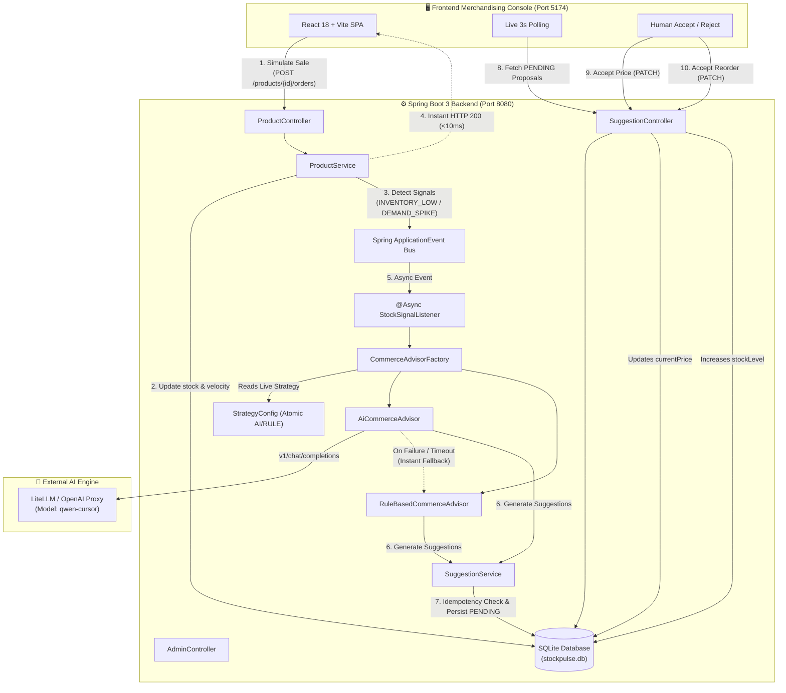

<div align="center">

# ⚡ StockPulse
### **AI Inventory Replenishment & Real-Time Dynamic Pricing 9 Engine**

[](https://openjdk.org/)
[](https://spring.io/projects/spring-boot)
[](https://reactjs.org/)
[](https://www.typescriptlang.org/)
[](https://vitejs.dev/)
[](https://sqlite.org/)

<p align="center">
  <b>An autonomous merchandising control center that monitors stock thresholds and demand velocity spikes to generate AI-assisted pricing adjustments and reorder proposals with Human-in-the-Loop approval.</b>
</p>

</div>

---

## 🏛 System Architecture & Agentic Flow

<div align="center">
  
</div>

<br/>



---

## 🌟 Core Feature Matrix

| Feature | Technical Implementation | Safety / Resilience |
|---|---|---|
| **Autonomous Signal Detection** | Triggers on `stockLevel < reorderThreshold` or `demandVelocity > 2 * categoryAvg` | Non-blocking Spring ApplicationEvent bus (`@Async` thread pool) |
| **Dual Proposal Generation** | Computes **both** Pricing & Reorder suggestions in a single evaluation cycle | Single structured JSON prompt reduces LLM roundtrips by 50% |
| **Human-in-the-Loop (HITL)** | All recommendations start in `PENDING` state | **Zero automatic mutation**; product prices/stocks only mutate on explicit `ACCEPT` |
| **Dynamic Strategy Switch** | Runtime toggling between `AI` and `RULE` modes via `PUT /admin/strategy` | Thread-safe `AtomicReference` — **zero application restart required** |
| **AI Validation & Fallback** | Parses and validates price positivity, quantity, confidence range (0-1), and enums | On timeout, connection error, or invalid JSON &rarr; **instant fallback to rules** |
| **Database Idempotency** | Prevents duplicate `PENDING` proposals for `(productId, triggerReason, suggestionType)` | Database query-level check avoids suggestion spam |
| **Embedded Persistence** | SQLite file-based persistence (`stockpulse.db`) via `sqlite-jdbc` & Hibernate | Pre-seeded with **28 demo products** with instant disk persistence |

---

## 📦 Project Structure

```text
Stock-pulse/
├── backend/
│   ├── src/main/java/com/stockpulse/
│   │   ├── StockPulseApplication.java    # Spring Boot + @EnableAsync
│   │   ├── domain/                       # JPA Entities: Product, PricingSuggestion, ReorderSuggestion
│   │   ├── repository/                   # Spring Data JPA Repositories
│   │   ├── service/                      # ProductService, SuggestionService
│   │   ├── controller/                   # Product, Suggestion & Admin Strategy REST Endpoints
│   │   ├── advisor/                      # CommerceAdvisor, RuleBasedAdvisor, AiAdvisor, Factory
│   │   ├── event/                        # StockSignalEvent & Async Event Listener
│   │   ├── config/                       # DataSeeder (28 products), CorsConfig, AsyncConfig
│   │   ├── llm/                          # LiteLLM HTTP Client & Exception Handling
│   │   └── exception/                    # GlobalExceptionHandler (404, 409 Conflict)
│   ├── src/test/java/com/stockpulse/     # 14/14 Unit & Integration Tests (100% Passing)
│   ├── pom.xml                           # Maven dependencies (Spring Boot 3, SQLite, WebFlux)
│   └── Dockerfile                        # Multi-stage container deployment
├── frontend/
│   ├── src/
│   │   ├── components/                   # Header, ProductsTable, PricingCard, ReorderCard, Modals
│   │   ├── api/                          # Typed client with VITE_API_BASE_URL support
│   │   ├── types/                        # TypeScript domain contracts
│   │   ├── App.tsx                       # Dashboard layout with 3s live polling
│   │   └── index.css                     # Modern dark theme design system
│   ├── package.json                      # React 18, Vite, Lucide Icons
│   ├── vite.config.ts                    # Configured for Port 5174 with backend proxy
│   └── vercel.json                       # Vercel SPA routing
├── README.md                             # Project setup & architecture
├── FEATURES.md                           # Detailed feature & API specifications
├── ADR.md                                # Architecture Decision Records (ADR-001 to ADR-006)
└── .gitignore                            # Excludes .db, .env, target/, node_modules/
```

---

## 🚀 Quickstart Guide

### Prerequisites
- **Java 17+** (JDK 21 recommended)
- **Maven 3.8+**
- **Node.js 18+** & **npm**

---

### Step 1: Start the Backend (Port 8080)

In your first PowerShell terminal:

```powershell
cd c:\Stock-pulse\backend

# Set JDK 21 compiler path
$env:JAVA_HOME="C:\Users\zycus\.vscode\extensions\redhat.java-1.55.0-win32-x64\jre\21.0.11-win32-x86_64"
$env:Path = "$env:JAVA_HOME\bin;" + $env:Path

mvn spring-boot:run
```
Backend initializes on **`http://localhost:8080`** and creates `stockpulse.db` with 28 seed products.

---

### Step 2: Start the Frontend (Port 5174)

In your second PowerShell terminal:

```powershell
cd c:\Stock-pulse\frontend

npm.cmd install
npm.cmd run dev
```

Open **`http://localhost:5174`** in your browser.

---

## 🧪 Automated Testing

Run the full suite of unit and integration tests:

```powershell
cd c:\Stock-pulse\backend
$env:JAVA_HOME="C:\Users\zycus\.vscode\extensions\redhat.java-1.55.0-win32-x64\jre\21.0.11-win32-x86_64"
$env:Path = "$env:JAVA_HOME\bin;" + $env:Path
mvn test
```

### ✅ Test Suite Results (14/14 Tests Passed):
- `RuleBasedCommerceAdvisorTest`: Verifies +10% low stock formula, +5% demand spike rule, HOLD logic, and `max(1, 3*threshold - stock)` reorder math.
- `AiAdvisorFallbackTest`: Verifies valid AI JSON parsing, connection timeout fallback to `RULE`, and malformed JSON fallback.
- `ProductServiceTest`: Verifies inventory-low and demand-spike signal detection upon order placement.
- `SuggestionServiceIntegrationTest`: Verifies price update on Accept, stock increment on Accept, reject preservation, and duplicate proposal suppression.

---

## 📡 REST API Reference

| Endpoint | Method | Purpose |
|---|---|---|
| `/products` | `GET` | Retrieve catalog (supports `?category=` and `?search=`) |
| `/products` | `POST` | Create custom product |
| `/products/{id}/orders` | `POST` | Place an order (triggers async agentic loop) |
| `/products/{id}/suggest-pricing` | `POST` | Manually generate pricing proposal |
| `/products/{id}/suggest-reorder` | `POST` | Manually generate reorder proposal |
| `/pricing-suggestions` | `GET` | Fetch pricing suggestions (`?status=PENDING`) |
| `/pricing-suggestions/{id}` | `PATCH` | Accept (`{"action": "ACCEPT"}`) or Reject |
| `/reorder-suggestions` | `GET` | Fetch reorder suggestions (`?status=PENDING`) |
| `/reorder-suggestions/{id}` | `PATCH` | Accept (`{"action": "ACCEPT"}`) or Reject |
| `/admin/strategy` | `GET` / `PUT` | Read or live-switch strategy (`AI` / `RULE`) |
